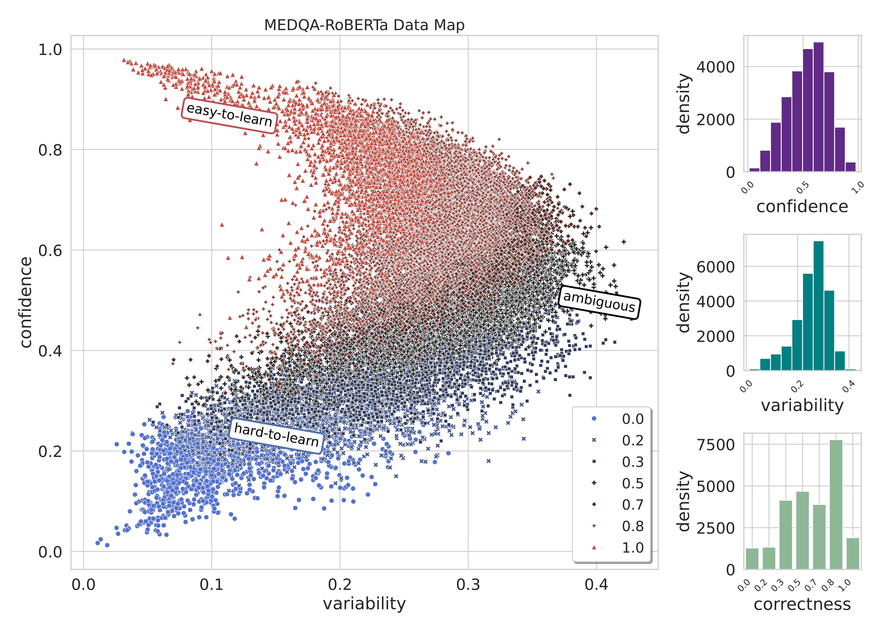

## Results


Data map analysis on the MEDQA dataset using the performance of the ROBERTA-Large classifier with 182,822 training samples. Only 25,000 samples are displayed for clarity. The x-axis indicates variability, ranging from low to high, while the y-axis represents the confidence levels of the classifier. The visualisation uses different colours and shapes to indicate correctness. Red triangles represent easy-to-learn examples with low variability and high confidence, blue circles represent hard-to-learn instances with low variability and low confidence, and black pluses represent ambiguous cases with high variability. This intuitive representation provides a comprehensive overview of the dataset with respect to the classifier.

| Training Scenario | MedQA Test (ID) | GP-UK (OOD) |
| ------------------ | --------------- | ----------- |
| 100% train         | **36.07**        | **30.50**    |
| 33% (random)       | 33.38           | 20.34       |
| 33% (ambiguous)    | 33.02           | 22.03       |


## Create Env
   ```bash
   conda create --name l101 python=3.8
   conda activate l101
   pip install -r requirements.txt 
   ```
## Download data


Download the data from Google Drive using the command line: `gdown` (Python-based tool for downloading Google Drive files)

1. **Install gdown:**
   If you don't have `gdown` installed, you can install it using `pip`:

   ```bash
   pip install gdown
   ```

2. **Navirate to L101 and make data folder**
   ```bash
   cd ~/L101/
   mkdir -p data/MEDQA
   cd /data/MEDQA
   ```
3. **Download the File:**
   Once `gdown` is installed, you can use it to download the file. Copy the file ID from the Google Drive link you provided (it's the part after `id=`) and use it in the following command:

   ```bash
   gdown --id 15VkJdq5eyWIkfb_aoD3oS8i4tScbHYky
   ```
4. **Unzip data folder**
   ```bash
   unzip data.zip
   ```
## Run experiments
### Train

```bash
python -m cartography.classification.run_glue \
    -c configs/medqa.jsonnet \
    --do_train \
    --do_eval \
    -o $MODEL_OUTPUT_DIR
```

### Select ambiguous data

```bash
python -m cartography.selection.train_dy_filtering \
    --filter \
    --model_dir $MODEL_OUTPUT_DIR \
    --data_dir $PATH_TRAIN_DATA/data/MEDQA \
    --task_name MEDQA \
    --metric variability
    --filtering_output_dir $PATH_WHERE_YOU_WANT_TO_HAVE_FILTERED_DATA \
    --model RoBERTa
```
Do not use  `--worst` nor  `--both_ends`.

### Select random data

```bash
python -m cartography.selection.random_filtering.py \
    --input_dir $PATH_TRAIN_DATA/data/MEDQA \
    --task_name MEDQA \
    --fraction 0.33 \
    --filtering_output_dir $PATH_WHERE_YOU_WANT_TO_HAVE_FILTERED_DATA \

```

### Plot Data Maps

```bash
python -m cartography.selection.train_dy_filtering \
    --model_dir $MODEL_OUTPUT_DIR \
    --plot \
    --task_name MEDQA \
    --plots_dir $PATH_WHERE_YOU_WANT_TO_HAVE_PLOT \
    --model RoBERTa
```
